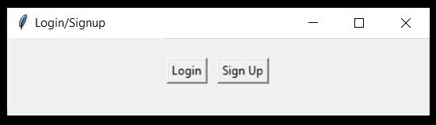
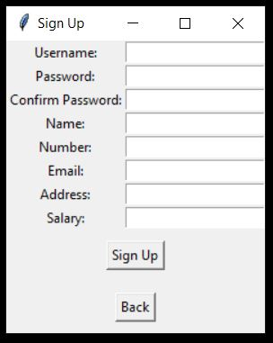
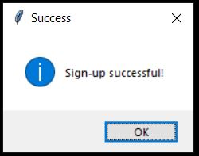
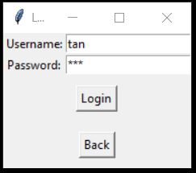
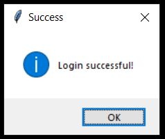

# LoginUI
Login/SignUp Made with tkinter python.
## Here are some screen shots of my work.
### First Window
Just 2 Buttons here Login and SignUp option

### Second Window
After Clicking on the "SignUp" button it will open this window where you can enter your details to create an account.

### Third Window
Successfull Signup Window

### Fourth Window
After clicking on the "Login" button it will open this window where you can enter your username and password to login in the system.

### Fifth Window
Successfull Login Window

### Sixth Window
After Login Details

